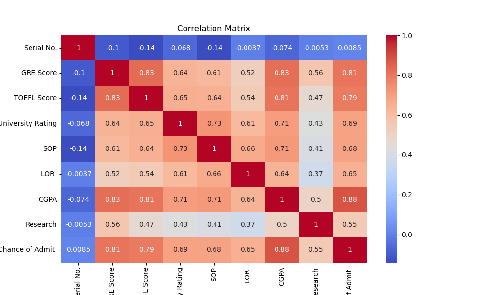
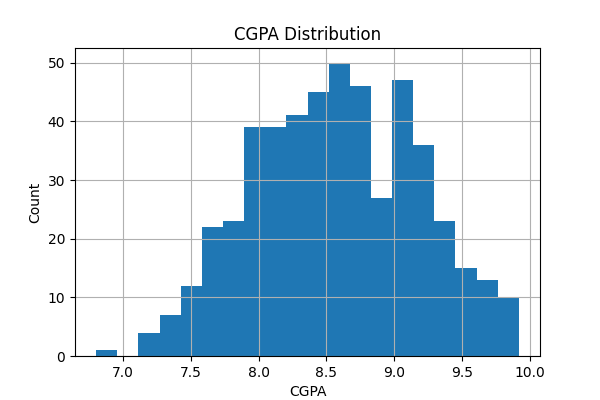
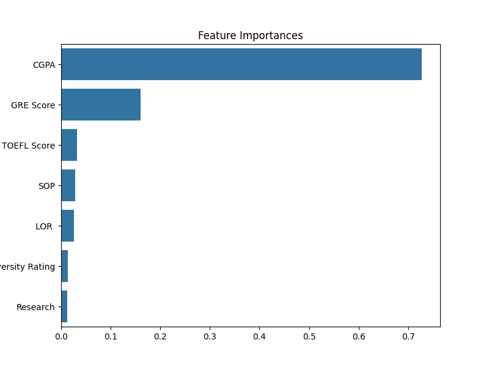

# Graduate Admission Prediction

## Dataset Preview
```
First five rows:
   Serial No.  GRE Score  TOEFL Score  University Rating  SOP  LOR   CGPA  Research  Chance of Admit 
0           1        337          118                  4  4.5   4.5  9.65         1              0.92
1           2        324          107                  4  4.0   4.5  8.87         1              0.76
2           3        316          104                  3  3.0   3.5  8.00         1              0.72
3           4        322          110                  3  3.5   2.5  8.67         1              0.80
4           5        314          103                  2  2.0   3.0  8.21         0              0.65

Data info:
<class 'pandas.core.frame.DataFrame'>
RangeIndex: 500 entries, 0 to 499
Data columns (total 9 columns):
 #   Column             Non-Null Count  Dtype
---  ------             --------------  -----
 0   Serial No.         500 non-null    int64
 1   GRE Score          500 non-null    int64
 2   TOEFL Score        500 non-null    int64
 3   University Rating  500 non-null    int64
 4   SOP                500 non-null    float64
 5   LOR                500 non-null    float64
 6   CGPA               500 non-null    float64
 7   Research           500 non-null    int64
 8   Chance of Admit    500 non-null    float64
dtypes: float64(4), int64(5)
memory usage: 35.3 KB
None

Missing values per column:
Serial No.           0
GRE Score            0
TOEFL Score          0
University Rating    0
SOP                  0
LOR                  0
CGPA                 0
Research             0
Chance of Admit      0
dtype: int64
dtype: int64
dtype: int64

## Data Analysis

### Correlation Matrix


### CGPA Distribution


## Model Evaluation

```
Mean Squared Error: 0.0043
R2 Score: 0.7875
```

### Feature Importances


## Sample Predictions

```
Predicted Chance of Admission: 0.93 (for GRE=330, TOEFL=115, ...)
Predicted Chance of Admission: 0.82
```

## How to Run

1. Clone this repo.
2. Install requirements:
   ```
   pip install pandas scikit-learn matplotlib seaborn joblib
   ```
3. Place `Admission_Predict.csv` in the repo folder.
4. Run `admission_prediction_full.py`